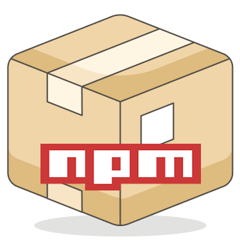
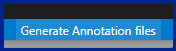

# Package Annotator

Package Annotator is a VS Code extension that adds user defined annotations to the "scripts" section of *package.json* files.

## Setup
Annotations are stored in a *package.annotations.json* file in the same directory as the *package.json* file.
1. Use the Annotations Generator to create a *package.annotations.json* file for every *package.json* file in your workspace.

   

2. Add annotations to the *package.annotations.json* file.
3. Annotations will appear in the *package.json* file:

	

4. (OPTIONAL) Add 'package.annotations.json' to the list off file patterns to nest under *package.json* files in the Explorer's [File Nesting Patterns](vscode://settings/explorer.fileNesting.patterns) VS Code settings

#### **Note: [`Editor Code Lens`](vscode://settings/editor.codeLens) must be enabled in VS Code settings for the annotations to appear.**

## Settings

### `"PackageAnnotator.enabled"`
This setting enables or disables the extension.
* Options: `true` OR `FALSE`
* _Default: `true`_

### `"PackageAnnotator.hideMissingAnnotationsWarning"`
This setting ignores the *'missing annotations'* status bar warning.
* Options: `true` OR `FALSE`
* _Default: `false`_