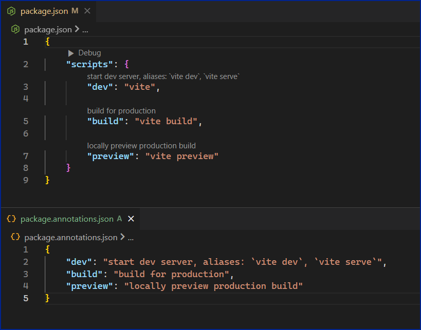

# Package Annotator

Package Annotator is a VS Code extension that adds annotations to package.json files.

## Functionality
Loads annotations for package.json files based on an associated package.annotations.json file.

## Installation
1. Install the *Package Annotator* extension from the VS Code Marketplace.
2. A warning appear on the status bar if a package.annotations.json file is missing. Click the warning to create a placeholder package.annotations.json file.
3. Edit the package.annotations.json file to add descriptions for the scripts in your package.json file.
4. Annotations will appear in the package.json file:

&nbsp;&nbsp;&nbsp;&nbsp;
&nbsp;&nbsp;&nbsp;&nbsp;

### `Note: Code Lens must be enabled in VS Code for the annotations to appear.`

## Settings

### `"PackageAnnotator.enabled"`
This setting enables or disables the extension.
* Options: `true` OR `FALSE`
* _Default: `true`_

### `"PackageAnnotator.ignoreMissingAnnotationsWarning"`
This setting ignores the *'missing annotations'* status bar warning.
* Options: `true` OR `FALSE`
* _Default: `false`_